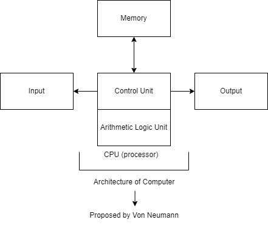
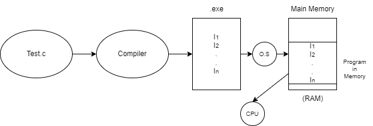
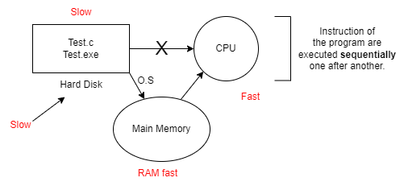

# 1.1 What is Operating System
An Operating System (OS) is the interface between the user and the computer.

### Control Unit
- Controls timing and control signals
- Controls the operation
- Sequencing & execution of micro-operations
    1. `MAR <- PC` (Move PC to MAR)
    2. `MDR <- Memory[MAR]` (Load instruction into MDR)
    3. `IR <- MDR` (Move MDR to IR)

### Arithmetic Logic Unit (ALU)
- Carries arithmetic and logical operations
- Consists of adders and subtractors

### Memory
#### 1. Primary (Main)
- Volatile, faster to access, expensive, lower size
- RAM, ROM, Cache, Registers

#### 2. Secondary (Auxiliary)
- Non-volatile, slower to access, less expensive, larger size
- Hard disk, Pendrives

---
### Questions
**Q1: Where is secondary memory then?**  
**A1:** As per Von Neumann Architecture, Secondary Memory are the part of Input Output Devices.

**Q2: How are programs executed in the VNA?**  
**A2:**  
  
When a program is loaded in memory for execution, this is called the **Stored Program Concept**.

CPU can't execute the program directly from the hard disk.

  

---
[Back](Chapter1.md)