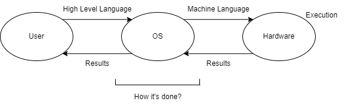

# 1.2 Function & Goals of Operating System
## 1.  Fundamental Principles of VNA
- **Stored Program Concept**: Any program that has to be executed must be stored in Main Memory (MM).
- **Sequential Execution of Instructions**.

  

### Operating System Modules
The operating system consists of several modules, each responsible for different aspects of system management:

- **Process Manager**: Manages CPU processes and scheduling.
- **Memory Manager**: Handles memory allocation and deallocation.
- **File Manager**: Oversees file operations and access.
- **Device Manager**: Manages input/output devices and their operations.
- **Protection Manager**: Ensures resource protection and access control.

These modules collectively form the **Kernel** (core/nucleus) of the Operating System.

---

### Additional Goals of the Operating System
The operating system aims to provide an efficient, user-friendly interface for both users and applications, achieving several goals:

- **Resource Management**: Efficiently managing hardware and software resources.
- **Security**: Protecting system resources and user data.
- **User Interface**: Offering a user-friendly interface for interaction.
- **Task Scheduling**: Optimizing CPU usage and managing multiple tasks.
- **Error Handling**: Managing errors and providing feedback to users.

---

## 2. Resource Manager
The Resource Manager is responsible for managing system resources:

- **Allocation**: Assigning resources as needed.
- **Deallocation**: Releasing resources when no longer needed.
- **Management**: Overseeing resource usage.

### Types of Resources
- **Software**: Files, applications, smartphones, monitors, etc.
- **Hardware**: CPU, monitors, I/O devices.

---

## 3. Control Program
A Control Program is responsible for controlling all the operations of the computer.

---

## 4. Set of Utilities to Simplify Application Development
The operating system provides a set of utilities to simplify application development by:

- Taking charge of hardware resources.
- Creating an environment or platform that helps developers focus on high-level tasks.
- Performing necessary operations behind the scenes, allowing developers to work more efficiently.

---

## 5. Acts Like a Government
The operating system can be likened to a government in several ways:

- It consists of several managers and modules; the OS is not a single program but a collection of services.
- Just like a government serves its citizens, the OS acts as a service provider for applications and users.
- The OS functions as a Resource Manager, similar to how a government manages national resources.
  
---

## OS in Mobile Devices
- Modern operating systems extend to mobile devices, where they handle additional layers like **middleware** for supporting services such as multimedia, databases, and graphics.
- Examples: **Apple iOS**, **Google Android**.

---

## Interrupts and OS Handling
- **Interrupts**: Signals that inform the OS of an event that needs immediate attention.
- The OS handles interrupts using **interrupt vectors** to direct control to the appropriate handler.
- **Trap**: A software-generated interrupt due to an error or user request, such as a system call.

---
[Next](Chapter1.2b.md)