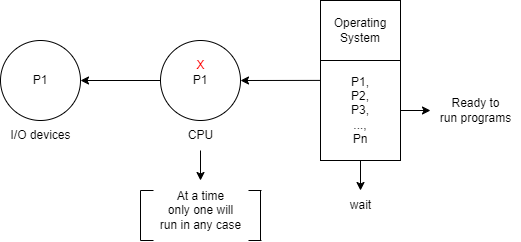
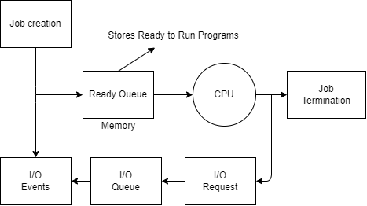

# Types of Operating Systems

### 1st Generation - No Operating System
- **Manual operation**: 
  - Early computers had no operating system.
  - Programs were executed manually by users, often using switches and punch cards.

### 2nd Generation - Magnetic Tapes (No Operating System)
- **Batch Processing**: 
  - Programs were loaded sequentially using punch cards and magnetic tapes.
  - There was no operating system, and users interacted directly with hardware.

### 3rd Generation - Magnetic Disk (Hard Disk) & Floppy Disk
- **Uniprogramming**: 
  - The OS could hold a single program in memory at a time.
  - CPU remained idle during I/O operations, resulting in inefficiency.
  
- **Multiprogramming**:
  - The OS could hold multiple programs in memory simultaneously.
  - This allowed for better CPU utilization by running another program while one is waiting for I/O.
  - Increased throughput and efficiency.

---

## Processor Types

### Uniprocessor
- **Description**:  
  A uniprocessor system has only one CPU on the motherboard.
  
- **Issue**:  
  When a process moves to I/O operations, the CPU becomes idle, leading to lower throughput and reduced efficiency.

- **Throughput**:  
  Number of programs completed in a unit of time.
  
  
  
- **Example**:  
  MS-DOS (Disk Operating System, 1990) – A command-based system with no GUI.

---

### Multiprocessor
- **Description**:  
  A multiprocessor system has multiple CPUs on the motherboard, allowing concurrent processing of multiple tasks.
  
- **Objective**:  
  Maximize CPU utilization, improve efficiency, and increase throughput.
  
  

- **Impression**:  
  Provides the impression of multiplexing the CPU among different programs.

---

### Multitasking Operating System
- In **Unix**, a "program" is equivalent to a "task" in **Windows**. Both refer to the same concept of multitasking within an operating system.

---

### Schematic View of Multiprogramming

- **Impact**:  
  CPU utilization is increased, and idleness is decreased.

---

## Types of Multiprogramming

### Preemptive Multiprogramming
- **Definition**:  
  The operating system can forcibly deallocate a process from the CPU to ensure that all tasks receive a fair share of CPU time, particularly under the following conditions:
  
- **Characteristics**:  
  - **Time-Slicing**: Each process is allocated a specific time quantum. If it does not complete within that time, it is preempted, and the CPU is allocated to the next process.
  - **Priority Scheduling**: Higher priority tasks can preempt lower priority ones, allowing the system to respond quickly to critical processes.
  
### Non-Preemptive Multiprogramming
- **Definition**:  
  No process is forced to leave the CPU; it will release the CPU voluntarily when it completes its task or requires I/O operations.
  
- **Release Conditions**:  
  - The process completes all its instructions.
  - The process requires I/O operations.
  - A system call is made.

---

### Drawbacks of Non-Preemptive Multiprogramming
- **Starvation**:  
  Some processes may experience indefinite waiting for CPU access if higher priority processes keep running.
  
- **Lack of Interactivity**:  
  Responsiveness may be poor, as a long-running process can block others from executing.

---

### Preemptive Multiprogramming
- **Definition**:  
  In preemptive multiprogramming, the operating system can forcibly remove a process from the CPU to improve responsiveness and CPU utilization.

- **Examples**:  
  Operating systems like Windows 95, Windows 11, Unix, Linux, and macOS employ preemptive multitasking.

#### Improvements in Responsiveness
- The OS can deallocate a process that is hogging CPU time, allowing other waiting programs a chance to run.

---

### Pre-emption Mechanisms
- **Time-based Preemption**:  
  - If the OS allocates a time slice (e.g., 10 seconds) to a process (Px) that neither completes nor goes for I/O, this is characteristic of Multiprogrammed Time Sharing OS.
  
- **Priority-based Preemption**:  
  - If a higher-priority process (Py) arrives while a lower-priority process (Px) is running, the OS can remove Px from the CPU, allowing Py to execute.
---

### Multitasking Operating System
- **Definition**:  
  A multitasking OS employs preemptive multiprocessing to manage multiple tasks efficiently.

---

### Architectural Requirements for Implementing a Multiprogrammed OS (Hardware)

1. **Secondary Storage Device (I/O)**:  
   - Must be **DMA compatible** (Direct Memory Access).
   - This ensures efficient data transfer between secondary storage and main memory.

2. **Memory System Should Support Address Translation**:  
   

   - **Reason for Two Addresses**:  
     - **Security**: Using a single physical address allows each program to directly access physical memory locations. This can lead to issues where a buggy program might overwrite memory used by another program, corrupting data and causing crashes.
     - **Logical Addresses**: By using logical addresses, an abstraction layer is created. Programs operate with logical addresses, which the OS translates to physical addresses, ensuring that programs do not interfere with each other's memory space.

3. **Processor (CPU)**:  
   - **Dual-Mode Operation**:  
     - The processor should support **two modes of operation**:
       - **User Mode**: Where regular applications run with limited access to system resources.
       - **Kernel Mode**: Where the operating system operates with full access to hardware and critical system resources.
     - **Purpose**:  
       - This dual-mode operation is essential for ensuring system security and stability, as the **operating system** can switch the processor to **kernel mode** when performing critical tasks (like I/O operations or memory management), preventing user applications from directly interfering with sensitive hardware functions.