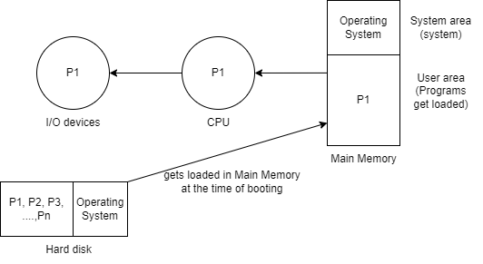
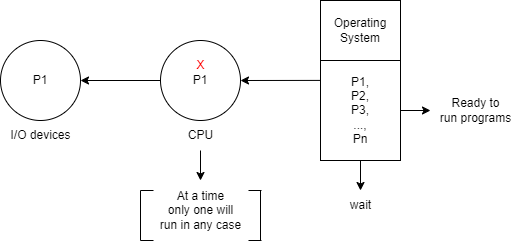
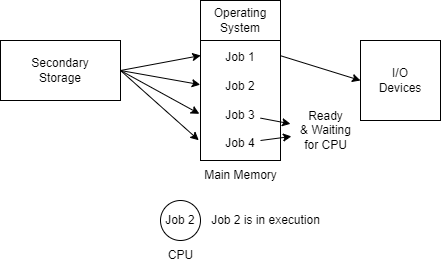

# 1.4 Multiprogrammed Operating System

## Processor Types

### Uniprocessor
- **Description**:  
  A uniprocessor system has only one CPU on the motherboard.
  
- **Issue**:  
  When a process moves to I/O operations, the CPU becomes idle, leading to lower throughput and reduced efficiency.

- **Throughput**:  
  Number of programs completed in a unit of time.
  
  
  
- **Example**:  
  MS-DOS (Disk Operating System, 1990) – A command-based system with no GUI.

### Multiprocessor
- **Description**:  
  A multiprocessor system has multiple CPUs on the motherboard, allowing concurrent processing of multiple tasks.
  
- **Objective**:  
  Maximize CPU utilization, improve efficiency, and increase throughput.
  
  

- **Impression**:  
  Provides the impression of multiplexing the CPU among different programs.

### Multitasking Operating System
- In **Unix**, a "program" is equivalent to a "task" in **Windows**. Both refer to the same concept of multitasking within an operating system.

### Schematic View of Multiprogramming

- **Impact**:  
  CPU utilization is increased, and idleness is decreased.

---

## Multiprocessing Architectures
- **Symmetric Multiprocessing (SMP)**: All processors share the same memory and are equal; tasks are distributed evenly.
- **Asymmetric Multiprocessing (AMP)**: Each processor is assigned a specific task, and one processor controls the system.

---
[Back](Chapter1.md)