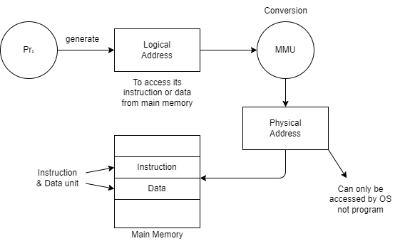
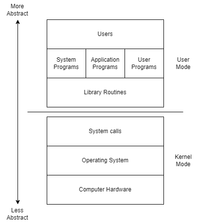

# 1.5 Architectural Requirements for Multiprogrammed OS

## Types of Multiprogramming

### Preemptive Multiprogramming
- **Definition**:  
  The operating system can forcibly deallocate a process from the CPU to ensure that all tasks receive a fair share of CPU time, particularly under the following conditions:
  
- **Characteristics**:  
  - **Time-Slicing**: Each process is allocated a specific time quantum. If it does not complete within that time, it is preempted, and the CPU is allocated to the next process.
  - **Priority Scheduling**: Higher priority tasks can preempt lower priority ones, allowing the system to respond quickly to critical processes.
  
### Non-Preemptive Multiprogramming
- **Definition**:  
  No process is forced to leave the CPU; it will release the CPU voluntarily when it completes its task or requires I/O operations.
  
- **Release Conditions**:  
  - The process completes all its instructions.
  - The process requires I/O operations.
  - A system call is made.

### Pre-emption Mechanisms
- **Time-based Preemption**:  
  - If the OS allocates a time slice (e.g., 10 seconds) to a process (Px) that neither completes nor goes for I/O, this is characteristic of Multiprogrammed Time Sharing OS.
  
- **Priority-based Preemption**:  
  - If a higher-priority process (Py) arrives while a lower-priority process (Px) is running, the OS can remove Px from the CPU, allowing Py to execute.

## Architectural Requirements for Implementing a Multiprogrammed OS (Hardware)

1. **Secondary Storage Device (I/O)**:  
   - Must be **DMA compatible** (Direct Memory Access).
   - This ensures efficient data transfer between secondary storage and main memory.

2. **Memory System Should Support Address Translation**:  
   

   - **Reason for Two Addresses**:  
     - **Security**: Using a single physical address allows each program to directly access physical memory locations. This can lead to issues where a buggy program might overwrite memory used by another program, corrupting data and causing crashes.
     - **Logical Addresses**: By using logical addresses, an abstraction layer is created. Programs operate with logical addresses, which the OS translates to physical addresses, ensuring that programs do not interfere with each other's memory space.

3. **Processor (CPU)**:  

   - **Dual-Mode Operation**:  
     The processor should support **two modes of operation**:
     
     - **User Mode (1)**:  
       - **Description**: This is a non-privileged mode where regular applications, such as Microsoft PowerPoint, run with limited access to system resources.
       - **Characteristics**:  
         - User applications cannot directly access hardware or critical system resources.
         - **Preemptive**: The operating system can interrupt these processes to ensure fair CPU time distribution.

     - **Kernel Mode (0)**:  
       - **Description**: This is a privileged mode where the operating system operates with full access to hardware and critical system resources.
       - **Characteristics**:  
         - Routine programs (such as process management, file management, etc.) execute at this level.
         - **Non-Preemptive**: Typically, kernel-level routines are not preempted to maintain stability and consistency during critical operations.

   - **Processor Status Word (PSW)**:  
     - A register in the CPU known as the **Processor Status Word (PSW)** contains a mode bit.
     - **Mode Bit**: 
       - **0**: Kernel mode  
       - **1**: User mode  
     - **Mode Switching**:  
       - It becomes necessary to shift modes between User and Kernel, allowing the OS to control access to resources and ensure stability.
       - If a user application wants to avail itself of OS kernel services, then mode shifting is a must.
       
     

     - **Kernel Mode**:
       - In Kernel mode, the executing code has complete and unrestricted access to the underlying hardware. Crashes in kernel mode are catastrophic and will halt the entire system.

     - **User Mode**:
       - In User mode, the executing code has no ability to directly access hardware or reference memory. Crashes in user mode are recoverable as isolation is maintained by the OS.

---
[Back](Chapter1.md)