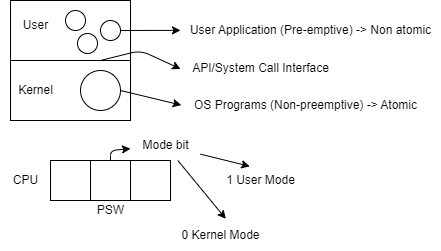

# Mode Shifting in Multiprogramming OS



---

### Overview
- **Operating System**: Service Provider  
- **User Programs**: Service User  

Whenever we need an OS service, we shift from **user mode** to **kernel mode**. After completing the service, we switch back to **user mode**.

**Mode shifting** is necessary to avail OS services.

---

### API: Application Program Interface
- An API informs the user about the OS services available.

---

### Example of Mode Shifting in a User Program

Here’s a C code example illustrating a user program:

```c
#include <stdio.h>

int main() {
    int a, b, c;
    b = 1;
    c = 2;
    a = b + c;
    f(a);  // Calls user-defined function f
}

void f(int k) {
    k++;
    printf("%d", k);
}
```

In this example:
- The program starts executing in **user mode**.
- The function `f` performs its operations in user mode.
- The call to `printf` outputs the value of `k`, and the function operates entirely within user mode.


**Note**: While all functions, whether predefined (like `printf`) or user-defined (like `f`), are executed in user mode, mode shifting occurs specifically when transitioning to kernel mode to utilize OS services, simply because they are written by user.

---

### Question: Where is `printf` defined?
- **Header file?** **Wrong!**  
  A header file, such as `stdio.h`, contains the function declaration (prototype) only, not the implementation. The implementation is found in the **library file** (e.g., .lib files).

**Purpose of Header Files**:
- **Type checking**: Ensures correct data types are used.
- **Syntactic correctness**: Validates the structure of the code.
- **Argument verification**: Checks that the correct number and type of arguments are passed to functions.

---

### Important Note
Compilers are not part of the OS. Therefore, the above program didn't require mode shifting.

```c
int main() {
    b = 1;
    c = 2;
    a = b + c;
    f(a);
    fork();
    printf("/d", a);
}

void f(int k) {
    k++;
}

```

### What is fork and What Does it Do?
- The execution of `fork` results in creating child processes.
- It is a type of special function (system call) called to the OS.
- `fork` is defined and implemented in the OS kernel.
- `fork` is an OS routine.

---

### Instruction Types
1. **Compile Time (CT)**
   - Represents the stage when code is compiled.

2. **Branch and Save Address (BSA)**
   - A non-privileged instruction.

---

## Execution Flow
### Function Execution
- **User Mode**: 
  - `f()` executes and transitions from CT to BSA.
  - Example: `f() -> CT -> BSA`

- **Kernel Mode**:
  - `fork()` executes and transitions from CT to SVC (Supervisory Call).
  - Example: `fork() -> CT -> SVC`
  - This involves:
    - Privileged Instructions
    - Soft Interrupt Instruction

---

### High-Level Program Execution
- High-level programs process instructions through the following sequence:
  1. **CT**: Compile Time
  2. **SVC**: Supervisory Call
  3. **RT**: Runtime
  4. **Software Interrupt**
  5. **ISR**: Interrupt Service     

    **OS -> CT -> SVC -> RT -> Software Interrupt -> ISR**