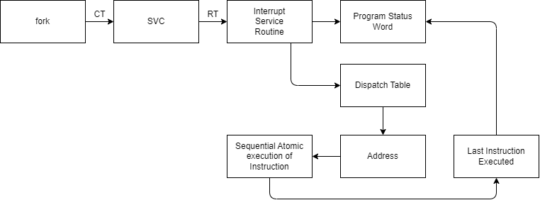
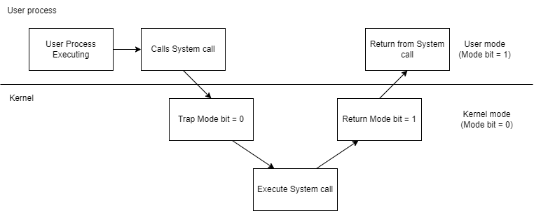

# Fork System Calls
### Instruction Types

1. **Compile Time (CT)**  
   This is the stage where the source code is translated into machine code or intermediate code by the compiler. It involves syntax checking, optimization, and error detection before execution. No actual instructions are executed at this point.

2. **Branch and Save Address (BSA)**  
   This instruction is used to change the flow of execution to another part of the program. It saves the current address (where the program was executing) so the program can return to it later. This instruction is non-privileged, meaning it can be executed in user mode without requiring kernel privileges.

---

## Execution Flow
### Function Execution
- **User Mode**: 
  - `f()` executes and transitions from CT to BSA.
  - Example: `f() -> CT -> BSA`

- **Kernel Mode**:
  - `fork()` executes and transitions from CT to SVC (Supervisory Call).
  - Example: `fork() -> CT -> SVC`
  - This involves:
    - Privileged Instructions
    - Soft Interrupt Instruction

---

### High-Level Program Execution
- High-level programs process instructions through the following sequence:
  1. **CT**: Compile Time
  2. **SVC**: Supervisory Call
  3. **RT**: Runtime
  4. **Software Interrupt**
  5. **ISR**: Interrupt Service     

    **OS -> CT -> SVC -> RT -> Software Interrupt -> ISR**

---

## Additional Information
- The OS maintains a table in the kernel, known as the **dispatch table** (a data structure in RAM), which lists all services the OS provides.

### Function Types
- **User-defined functions**: Execute in **user mode**.
- **Built-in (predefined) functions**: Execute in **user mode**.
- **System Calls**: Execute in **kernel mode**.

---

### OS Routines
- OS routines are accessed through **APIs** (e.g., `fork()`).
- System calls trigger a mode shift from user mode to kernel mode to access OS services.



---

## What is the Dispatch Table?
- The **dispatch table** is a critical data structure maintained by the OS in the kernel.
- It holds the list of all available OS services, including:
  - System calls
  - Interrupt routines
  - Device drivers
- Each entry in the table corresponds to a specific OS routine that can be called by user programs.
- When a system call is made (e.g., `fork()`), the OS uses the dispatch table to locate the appropriate routine to execute.

### Purpose of the Dispatch Table
- **Service Lookup**: Maps system calls and interrupt requests to specific kernel routines.
- **Execution Control**: Helps the OS efficiently manage service execution by knowing which routine to invoke.
- **Security**: Ensures that only valid, registered OS services can be accessed through user programs.

---

## Printf Implementation in Relation to System Calls

```c
printf();
write();
```
- `printf` is implemented in a **library file**.
- `printf` eventually needs to access a device (e.g., display), but device control is with the **operating system**.
- It uses the **write()** system call to perform output operations.

---
## Mode Shifting with `printf`
- When `printf` internally invokes a system call like `write()`, mode shifting occurs:
  - The execution shifts from user mode to kernel mode to access OS services (e.g., output to the device).

---
## The Execution Cycle: Transitioning Between User Mode and Kernel Mode


- **No interrupt** is generated during the switch from **kernel mode** back to **user mode**.
- A **privileged instruction** is used to switch from kernel to user mode without requiring an interrupt.

---