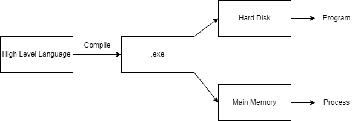
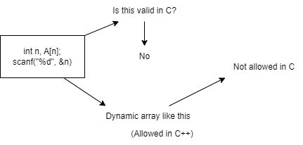
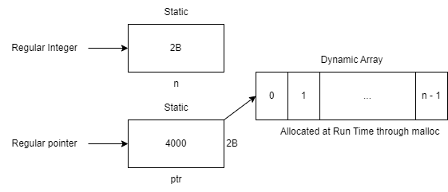

# Process Concepts and States

### Process:
- A **process** is a program in execution.
- When a program is loaded from disk to main memory, it becomes a process.

### Program:
- A **program** refers to an instance of a file, such as `.exe`, that is executed by the system.
- A program consists of:
  - **Data**: Operands or variables that the program manipulates.
  - **Instructions**: Commands like `Load`, `Add`, `Store`, `Multiply`, `SVC`, `BSA`, etc.

### Relationship Between Process and Program:
- A **process** is something created when a program is executed.
- The **program** itself is just a file or script on disk.



---

### Data in a Program:

- **Static Data**: Fixed size or known size.
  - Example: `int a;` where `a` takes up 2 bytes.
- **Dynamic Data**: Memory allocated at runtime.
  - Example: `int a[10];` where `a` takes up 20 bytes.

---

### Memory Allocation for Static Data:

- **When does memory allocation occur for static data?**
  - **Compile Time?**  
    No, during compile time, the compiler only checks for syntactic correctness and generates code. No memory allocation happens at this stage.
  
  - **What if the program is compiled but not run?**  
    It's possible to compile a program without running it, and no memory is allocated at this point. If memory were allocated at compile time, it would be a waste.

- **Correct Answer: Load Time**  
  Memory for static data is allocated during **load time**, which is before the program starts running. This is when the program is loaded from disk to memory for execution.



---

### How to Implement a Dynamic Array in C?

In C, you can create a dynamic array using `malloc` to allocate memory at runtime. Here's an example:

```c
#include <stdio.h>
#include <stdlib.h>

int main() {
    int n, *ptr;

    printf("Enter the number of elements: ");
    scanf("%d", &n);  // Input array size

    // Dynamically allocate memory for the array
    ptr = (int*)malloc(sizeof(int) * n);

    // Check if the memory allocation was successful
    if (ptr == NULL) {
        printf("Memory allocation failed!\n");
        return 1;
    }

    // Example: Initialize and print the array
    for (int i = 0; i < n; i++) {
        ptr[i] = i + 1;
        printf("%d ", ptr[i]);
    }

    // Free the allocated memory
    free(ptr);

    return 0;
}
```
- **`malloc`**: Allocates memory dynamically at runtime.
- **Size of memory**: `sizeof(int) * n` allocates memory for `n` integers.
- **Freeing memory**: It’s important to release allocated memory using `free()` to prevent memory leaks.



---

### Relationship between Objects, Classes, Processes, and Programs:

- **Object**: An instance of a class.
- **Process**: An instance of a program.

---

### What is a Process?

- **Definition**: A process is a program in execution, actively using computer resources (CPU, memory, etc.).
- **When does it become a process?**  
  A program becomes a process when it is loaded into memory and starts executing.
  
- **Key Characteristics**:
  - **Instance of a Program**: A process represents a running instance of a program.
  - **Active Entity**: Unlike a program, which is a passive set of instructions, a process is an active entity utilizing system resources.
  - **Always in Memory**: A process must be in memory to execute.
  - **Locus of Control for OS**: Similar to how people are the "locus of control" for a government, a process is controlled by the operating system.

- **Animated Spirit**: Think of the process as the "animated spirit" that brings a program to life.

---

### Process as an Abstract Data Type (ADT)

From a developer's perspective, we can treat a **process** as an **Abstract Data Type (ADT)**, similar to common data structures. 

Just like other data structures, a process has:
1. **Definition**
2. **Representation/Implementation**
3. **Operations**
4. **Attributes**

---

### Example: Linked List as an ADT

- **Definition**: A linked list is a sequence of nodes where each node contains data and a reference (or link) to the next node.
- **Representation**: Typically implemented as a chain of nodes in memory.
- **Operations**: Insertion, deletion, traversal, etc.
- **Attributes**: Head, tail, size, etc.

---

### Defining a Process:

- **Definition**: A process is an instance created from a program. In essence, when a program is loaded into memory and executed, it becomes a process.