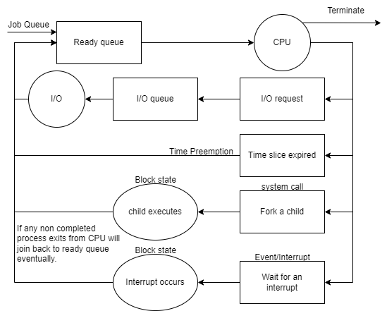
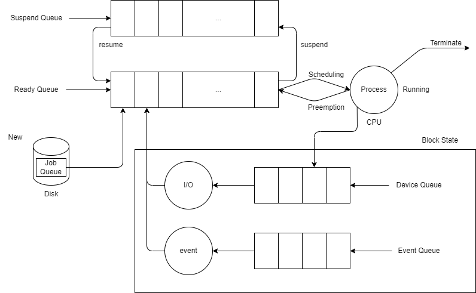
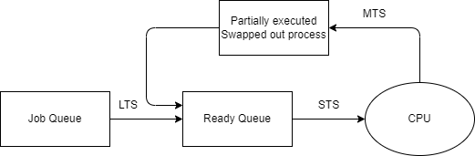
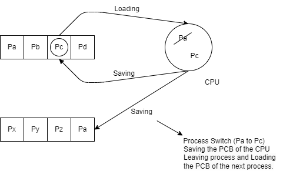

# Process Concepts and States

### Process:
- A **process** is a program in execution.
- When a program is loaded from disk to main memory, it becomes a process.

### Program:
- A **program** refers to an instance of a file, such as `.exe`, that is executed by the system.
- A program consists of:
  - **Data**: Operands or variables that the program manipulates.
  - **Instructions**: Commands like `Load`, `Add`, `Store`, `Multiply`, `SVC`, `BSA`, etc.

### Relationship Between Process and Program:
- A **process** is something created when a program is executed.
- The **program** itself is just a file or script on disk.


---

### Data in a Program:

- **Static Data**: Fixed size or known size.
  - Example: `int a;` where `a` takes up 2 bytes.
- **Dynamic Data**: Memory allocated at runtime.
  - Example: `int a[10];` where `a` takes up 20 bytes.

---

### Memory Allocation for Static Data:

- **When does memory allocation occur for static data?**
  - **Compile Time?**  
    No, during compile time, the compiler only checks for syntactic correctness and generates code. No memory allocation happens at this stage.
  
  - **What if the program is compiled but not run?**  
    It's possible to compile a program without running it, and no memory is allocated at this point. If memory were allocated at compile time, it would be a waste.

- **Correct Answer: Load Time**  
  Memory for static data is allocated during **load time**, which is before the program starts running. This is when the program is loaded from disk to memory for execution.


---

### How to Implement a Dynamic Array in C?

In C, you can create a dynamic array using `malloc` to allocate memory at runtime. Here's an example:

```c
#include <stdio.h>
#include <stdlib.h>

int main() {
    int n, *ptr;

    printf("Enter the number of elements: ");
    scanf("%d", &n);  // Input array size

    // Dynamically allocate memory for the array
    ptr = (int*)malloc(sizeof(int) * n);

    // Check if the memory allocation was successful
    if (ptr == NULL) {
        printf("Memory allocation failed!\n");
        return 1;
    }

    // Example: Initialize and print the array
    for (int i = 0; i < n; i++) {
        ptr[i] = i + 1;
        printf("%d ", ptr[i]);
    }

    // Free the allocated memory
    free(ptr);

    return 0;
}
```
- **`malloc`**: Allocates memory dynamically at runtime.
- **Size of memory**: `sizeof(int) * n` allocates memory for `n` integers.
- **Freeing memory**: It’s important to release allocated memory using `free()` to prevent memory leaks.


---

### Relationship between Objects, Classes, Processes, and Programs:

- **Object**: An instance of a class.
- **Process**: An instance of a program.

---

### What is a Process?

- **Definition**: A process is a program in execution, actively using computer resources (CPU, memory, etc.).
- **When does it become a process?**  
  A program becomes a process when it is loaded into memory and starts executing.
  
- **Key Characteristics**:
  - **Instance of a Program**: A process represents a running instance of a program.
  - **Active Entity**: Unlike a program, which is a passive set of instructions, a process is an active entity utilizing system resources.
  - **Always in Memory**: A process must be in memory to execute.
  - **Locus of Control for OS**: Similar to how people are the "locus of control" for a government, a process is controlled by the operating system.

- **Animated Spirit**: Think of the process as the "animated spirit" that brings a program to life.

---

### Process as an Abstract Data Type (ADT)

From a developer's perspective, we can treat a **process** as an **Abstract Data Type (ADT)**, similar to common data structures. 

Just like other data structures, a process has:
1. **Definition**
2. **Representation/Implementation**
3. **Operations**
4. **Attributes**

---

### Example: Linked List as an ADT 

- **Definition**: A linked list is a sequence of nodes where each node contains data and a reference (or link) to the next node.
- **Representation**: Typically implemented as a chain of nodes in memory.
- **Operations**: Insertion, deletion, traversal, etc.
- **Attributes**: Head, tail, size, etc.

---

### Defining a Process:

- **Definition**: A process is an instance created from a program. In essence, when a program is loaded into memory and executed, it becomes a process.


#### Data Types in Memory:

1. **Uninitialized Data**: 
   - Example: `int x;` 
   - This variable does not have an initial value assigned.

2. **Initialized Data**: 
   - Example: `int x = 1;` 
   - This variable is assigned an initial value upon declaration.
   - **`.bss` (Block Started by Symbol)**: This segment is used by the program to hold uninitialized global and static variables.
#### Activation Record:

- An **activation record** does not contain the address of the function itself. Instead, it holds:
  - **Information**: Details about the local variables of the function.
  - **Space for Local Variables**: Memory allocated for local variables declared within the function.
  - **Return Address**: The address to which control will return after the function execution completes.

#### `.bss` Segment in Detail:

The **`.bss` segment** (Block Started by Symbol) is a section of memory in the program's executable file that holds statically-allocated variables that are **uninitialized** or initialized to zero at the start of the program. The `.bss` segment does not take up actual space in the executable file but is allocated memory when the program runs.

#### Key Characteristics:
- **Used for**: Global and static variables that are uninitialized or explicitly initialized to zero.
- **Initial value**: The operating system ensures that all variables in this segment are initialized to `0` at runtime.
- **Efficiency**: Since these variables don't have an initial value, the `.bss` segment doesn't increase the size of the compiled binary. Memory for `.bss` variables is allocated at load time.
  
---

### Process Operations:

- **create()**: Resource allocation—process gets created, memory and resources necessary for the process are allocated.
- **schedule()**: The act of selecting a process to run on the CPU.
- **execute()/run()**: Executing instructions from the code section.
- **block()/wait()**: Process will get blocked when it executes a system call or I/O operation.
- **suspend()**: Sometimes we need to move the process from memory to disk.
- **resume()**: Sometimes we need to move the process from disk back to memory.
- **terminate()**: Resource deallocation.

---

### Process Attributes:

- **Identification**: 
  - **Pid**: Process ID of the process.
  - **PPid**: Parent Process ID of the process.
  - **gid**: Group ID associated with the process.
  
- **CPU Related**: 
  - **PC**: Program Counter, which holds the address of the next instruction to execute.
  - **Priority**: The level of importance of the process, influencing its scheduling.
  - **State**: The current state of the process (e.g., running, waiting, terminated).
  - **Burst Time**: The amount of time required by the process on the CPU during its execution.

- **Memory Related**:
  - **Size**: The amount of memory allocated to the process.
  - **Limits**: Constraints on memory usage (e.g., maximum memory limit).

- **File Related**:
  - **List of Files in Use**: Files that are currently opened or accessed by the process.

- **Device Related**:
  - **List of Devices**: Devices that the process is currently using or has access to.

- **Accounting Related**:
  - **Resource Usage**: Tracking of CPU time, memory usage, and I/O operations performed by the process for accounting purposes.

### Process Control Block (PCB)

All of these attributes are stored in the **Process Control Block (PCB)**, which serves as an essential data structure for process management.


#### Key Features of PCB:
- **Constraints Attributes of Process**: The PCB holds all necessary information that defines the process and its constraints.
- **Unique to Each Process**: Every process in the system has its own PCB, ensuring that the operating system can manage multiple processes effectively.
- **Storage Location**: The PCB is stored in memory, allowing the operating system to quickly access and update the process information as needed.

---

### Total Content of PCB = Process Context/Environment

During the lifetime of a process, it transitions from one state to another. These transitions are represented in process state diagrams.

1. **New**: The process is created, and resources are allocated.
2. **Ready**: The process is ready to run on the CPU.
3. **Running**: The process is actively executing instructions on the CPU.
4. **Blocked/Waiting**: The process needs to perform I/O or execute a system call, so it leaves the CPU.
   - **I/O**: This could involve reading data from a device or writing data to a device.
5. **Terminate**: The process has completed all of its instructions, and resources are deallocated.

---

## Process State Transition Diagrams:

### Multiprogramming Process State Transition Diagram:


### Uniprogramming Process State Transition Diagram:


---

### Key Points About Process Completion:

- Every process **must** finish its execution from the **Running** state. Remember that!
- In most programs, we write the `exit` command or equivalent at the end, and this must be executed on the CPU to terminate the process.

---

### Important Notes:

1. **Process in Memory States**:  
   - A process in the **New** state is entering the main memory.  
   - A process in the **Terminate** state is leaving the main memory.
   - If a process is in the **Ready**, **Running**, or **Blocked** state, it is already present in the main memory.

2. **Number of Processes in Each State**:
   - **Ready/Blocked States**: There can be multiple processes in these states at any given time.
     - Theoretical limit: **Infinite** processes can be in these states.
   - **Running State**: Only one process per CPU can be in the **Running** state.
     - Maximum processes: **Number of CPUs**.

3. **Suspension**:  
   If the operating system cannot accommodate all the processes in main memory (e.g., there are 120 ready processes but the system can only hold 100), the OS will transfer the remaining processes from main memory to the hard disk to improve performance. This process is called **Suspension**.  
   - **Ready state** is the most desirable state for a process to be suspended.

---


1. **Process in Running State**: Initially, the process is in the running state, executing its instructions.
2. **Request for I/O Services or System Call**: The process may require I/O services, such as reading from a file or sending data over the network. It makes a system call to request the necessary I/O operation to complete. While in this state, the process is not actively executing instructions.
3. **I/O Operation Completion**: The operating system handles the requested I/O operation. For example, if the process requested to read data from a file, the operating system would perform the necessary disk I/O operation to read the data into memory.
4. **Process Resumes**: Once the I/O operation is complete, the process transitions back to the ready state, indicating that it is ready to continue executing. The operating system scheduler will then determine when to schedule the process for execution again.

---

## Complete State Transition Diagram


### Transition Details

- **New to Ready**:
  - **Action**: When a process is created (e.g., through a `fork()` system call or similar function).
  - **Reason**: The process is initialized and ready to be scheduled by the operating system.

- **Ready to Running**:
  - **Action**: The scheduler selects a process from the Ready queue to run.
  - **Reason**: The process has been allocated CPU time based on scheduling algorithms (like FIFO, Round Robin, etc.).

- **Running to Blocked**:
  - **Action**: The process makes a system call for I/O operations (e.g., reading from disk, waiting for user input).
  - **Reason**: The process cannot continue until the I/O operation completes, so it is placed in the Blocked state.

- **Running to Suspended Ready**:
  - **Action**: The operating system may decide to suspend the process if system resources are limited.
  - **Reason**: This transition typically occurs when the system needs to allocate resources to other processes, but the suspended process can still be resumed later.

- **Blocked to Ready**:
  - **Action**: Once the I/O operation completes or the required resource is available, the process is moved back to the Ready state.
  - **Reason**: The process is now eligible to be scheduled for execution.

- **Ready to Suspended Ready**:
  - **Action**: The operating system may suspend a process in the Ready state.
  - **Reason**: Similar to the transition from Running to Suspended Ready, this occurs when resources need to be freed for other processes.

- **Suspended Ready to Ready**:
  - **Action**: The suspended process is resumed and placed back in the Ready state.
  - **Reason**: Resources are now available, allowing the suspended process to continue.

- **Blocked to Suspended Block**:
  - **Action**: If a Blocked process needs to be suspended (for example, if the system is under heavy load).
  - **Reason**: This helps free resources while the process is waiting.

- **Suspended Block to Blocked**:
  - **Action**: The process is resumed and returns to the Blocked state if it was waiting for I/O or a resource.
  - **Reason**: The I/O operation or resource is now available, but the process cannot run until the CPU is allocated to it.

- **Running to Completed**:
  - **Action**: The process finishes its execution.
  - **Reason**: This indicates that the process has completed all tasks and is ready for cleanup.

- **Completed to Terminated**:
  - **Action**: The process is cleaned up by the operating system.
  - **Reason**: Resources used by the process are released, and it is removed from the process table.

---

## Question:
1. **Why the process moved from blocked to suspended block?**   
   **Answer**:  
   A process is moved to the "suspended block" state due to resource management and multitasking needs.

   When a process is in the blocked state, it's waiting for an I/O operation to complete. However, sometimes the operating system needs to free up resources (like memory), or it might need to pause the process for other reasons (like if the user switches to a different application). In these cases, the opearting system can move the process from its blocked state to the "suspended blocked" state.

   In the "suspended blocked" state, the process is not only waiting for an I/O operation to complete, but it's also been swapped out of main memory and placed onto disk storage. This frees up system resources and allows the operating system to work on other active processes.

   Once the I/O operation is complete and the system resources are available again, the process can be moved back into main memory and transitioned to the "ready" state, where it's eligible to continue running on the CPU.

   So, the transition to the "suspended blocked" state is a way for the operating system to manage system resources efficiently while ensuring that all processes get their turn to execute.

2. **Why send to suspend ready instead of ready?**    
   **Answer**:  
   The transition from "suspended blocked" to "suspended ready" instead of directly to "ready" is due to the way of operating systems manage memory and resources.

   When a process is in the "suspended blocked" state, it's not in the main memory but is swapped out to the disk. This is done to free up main memory for other active processes. When the I/O operation that the process was waiting for is complete, the process becomes "ready" in a logical sense, but it's still not in the main memory. So, it's in the "suspended ready" state.

   Before the process can actually be executed, (i.e., moved to the "ready" state), it needs to be brought back into the main memory from the disk. THis operation is known as "swapping in" or "loading". The decision of when to load the process back into main memory is made by the operating system based on varoius factors like system load, memory usage, priority of processes, etc.

   So, the "suspended ready" state is a way for the operating system to acknowledge that a process already to run but hasn't yet been loaded back into main memory. One the process is back in main meory, it moves to the "ready" state and can be scheduled to run on the CPU.

3. **Why resuming the process from suspended block to block instead of sending it to suspended ready and then ready?**    
   **Answer:**    
   - **Case 1 (Suspended Block -> Suspended Ready -> Ready)**:  
     This case is typically used when the system has enough resources (like memory) to keep the process in main memory but not enough to immediately allocate CPU time. The process moves to the **Suspended Ready** state to wait for CPU allocation, allowing the system to focus on higher-priority processes. This transition path helps ensure that the process will be ready to run when CPU resources become available.  
   
   - **Case 2 (Suspended Block -> Block -> Ready)**:  
    This transition occurs when the process in the **Suspended Block** state (which was waiting for I/O or a resource and had been suspended due to resource constraints) no longer needs to be suspended. Once the resource or I/O operation becomes available, the process transitions to the **Blocked** state to complete any remaining I/O or wait. Once the I/O operation completes or the required resource becomes available, the process can then move to the **Ready** state.

## Scheduling Queues & State Queuing Diagram

### Scheduling Queues

- **On Disk Queue**:
  - **Job Queue (New State)**:  
    Contains programs that are ready to be loaded into memory from the disk.

  - **Suspend Queue (Suspended States)**:  
    - Represents both **Suspended Block** and **Suspended Ready** processes.  
    - Contains the list of processes that have been suspended from memory onto disk.

- **In-Memory Queue**:
  - **Ready Queue (Ready State)**:  
    - Contains the list of **PCBs (Process Control Blocks)** of processes that are in the **Ready** state, waiting for CPU time.  
    - The nodes in this queue are PCBs linked together like a linked list.

  - **Block Queue (Blocked State)**:  
    Contains the list of **PCBs** of processes that are in the **Blocked** state, waiting for I/O operations to complete.

- **Device Queue** (Specific to I/O Devices):  
  - Each I/O device in the system has its own **Device Queue**.  
  - The **Device Queue** contains the list of **PCBs** of processes that are waiting for a particular I/O device to complete their operations.  
  - When a process makes a system call to access an I/O device (like reading from or writing to a disk), it is placed in that device’s queue until the I/O operation is finished. 

---

### State Queuing Diagram Explanation (Step-by-Step)



---



The state queuing diagram illustrates how processes move through different states and queues in the operating system. Below is a step-by-step breakdown:

1. **Job Queue (New State)**
   - **Description**: The process begins in the **Job Queue**, corresponding to the **New** state in the process state transition diagram.
   - **Explanation**: When a program is created, it is placed in the **Job Queue**. This queue contains programs that are ready to be loaded into the memory.

2. **Ready Queue (Ready State)**
   - **Description**: Once the program is loaded into memory, it becomes a process and moves to the **Ready Queue**.
   - **Explanation**: The **Ready Queue** contains processes that are loaded in memory and are ready to be executed by the CPU. However, only one process can be executed at a time, so they wait for CPU time.

3. **CPU Execution (Running State)**
   - **Description**: From the **Ready Queue**, one process is selected by the **Scheduler**, but it is the **Dispatcher** that gives control of the CPU to the selected process.
   - **Explanation**: The **Dispatcher** is responsible for transferring the control of the CPU to the process for execution. This moves the process into the **Running** state where it begins to execute instructions.

4. **Process Termination (Terminated State)**
   - **Description**: If the process completes all of its tasks, it will terminate.
   - **Explanation**: Once the process has finished executing, it is removed from the system, freeing up resources.

5. **I/O Request (Blocked State)**
   - **Description**: If the process requires input/output (I/O) operations (e.g., reading from a disk), it moves from the **Running** state to the **Blocked Queue**.
   - **Explanation**: In the **Blocked** state, the process waits for the I/O operation to complete. Each I/O device has its own **Device Queue**.

6. **Ready Again After I/O (Ready State)**
   - **Description**: After completing the I/O operation, the process moves back to the **Ready Queue**.
   - **Explanation**: The process becomes eligible for CPU execution again and waits in the **Ready Queue** for the CPU to be assigned.

7. **Suspension (Suspended States)**
   - **Description**: A process in the **Ready** or **Blocked** state can be moved to the disk, resulting in suspension.
   - **Explanation**: If the system needs to free up memory, processes can be suspended and moved to disk, either in the **Suspended Ready** or **Suspended Blocked** state. When resumed, they move back to their respective active states.

8. **Preemption**
   - **Description**: A running process can be preempted (e.g., due to higher-priority processes) and moved back to the **Ready Queue**.
   - **Explanation**: In the case of preemption, the process moves from the **Running** state back to the **Ready Queue**, allowing other processes to be scheduled.

9. **Process Resumption (Suspended Ready/Blocked to Ready/Blocked)**
   - **Description**: If a suspended process is resumed, it moves from **Suspended Ready** to **Ready**, or from **Suspended Blocked** to **Blocked**.
   - **Explanation**: This transition occurs when resources are available, and the process can continue its execution.

---

## Schedules and Dispatches
### Scheduling Overview
- **Scheduling** involves making decisions about which processes to move between various queues: job queue, ready queue, and suspend queue.
- **Scheduler**: The component of the operating system responsible for making scheduling decisions.
  - **Long Term Scheduler**: Moves processes from New to Ready.
  - **Short Term Scheduler (CPU Scheduler)**: Moves processes from Ready to Running.
  - **Medium Term Scheduler (Swapper)**: Handles process suspension and resuming.

*The names of the schedulers are based on their frequency of activation.*



#### Long Term Scheduler
- Controls the degree of multiprogramming by loading new programs into memory.

---

### Dispatcher

- The dispatcher is responsible for **context switching**, which involves:
  - Loading and saving processes during a switch on the CPU.
  - This activity ensures that the CPU can efficiently switch between different processes without idling.

- The dispatcher works closely with the **Short Term Scheduler** to:
  - Select the next process to run from the Ready Queue.
  - Perform the necessary actions to switch the context from the currently executing process to the next scheduled process.

- It is important to note that the dispatcher is **not involved in the suspension of processes**. This responsibility falls to the **Medium Term Scheduler (MTS)**, which manages:
  - The suspension and resumption of processes based on system resource availability and process priority.

  

---

## Example of Process Switching

1. **Initial State**: 
   - Several processes (P_A, P_B, P_C, P_D) are in the Ready Queue.
   - The CPU is currently executing process P_A.

2. **Preemption Occurs**:
   - If a preemption occurs while P_A is executing, the dispatcher will:
     - Save the context of P_A (its Process Control Block, PCB) to the Ready Queue.
     - Load the PCB of the next process (e.g., P_C) into the CPU.

3. **Context Switching Process**:
   - **Process Switch**: This refers to saving the PCB of the CPU-leaving process (P_A) and loading the PCB of the next process (P_C).
   - If P_A requires I/O service instead of being preempted, it will:
     - Save its PCB to the Blocked Queue, indicating that it is waiting for some I/O operation to complete.

4. **Active Contexts**:
   - Initially, the context of P_A is active in the CPU.
   - After the context switch, the context of P_C becomes active in the CPU.
   - This switch allows the CPU to continue executing processes without idling.

5. **Dispatcher Time**:
   - The time taken by the dispatcher to perform this context switching is referred to as:
     - **Context Switching Time**: The time taken for the dispatcher to save the PCB of the currently executing process and load the PCB of the next process.
     - **CPU Scheduling Overhead**: This encompasses the resources and time spent on managing context switches.
     - **Dispatch Latency**: The delay experienced while the dispatcher is carrying out these tasks.
   - The dispatcher is responsible for the activity of loading and saving the process during a process switch on the CPU, which includes:
     - Saving the PCB of the CPU-leaving process (e.g., P_A).
     - Loading the PCB of the next scheduled process (e.g., P_C) into the CPU.

6. **Process Switch Summary**:
   - When preemption occurs or when P_A requests an I/O operation, the dispatcher must:
     - Save the PCB of the currently executing process (P_A).
     - If it’s due to preemption, save it to the Ready Queue; if waiting for I/O, save it to the Blocked Queue.
     - Load the PCB of the next scheduled process (P_C) into the CPU to ensure continuous execution.
   - This transition between processes ensures that the CPU remains utilized and efficient, minimizing idle time.

---

