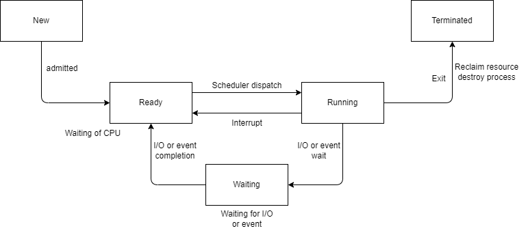
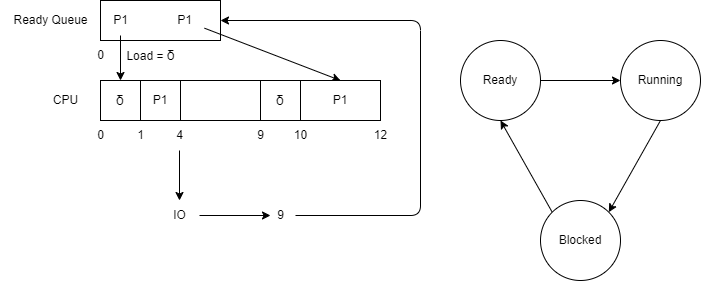

# CPU Scheduling

## Design and Implementation of Short-Term Scheduler

### Short-Term Scheduler Overview:
The **Short-Term Scheduler** (also known as the CPU Scheduler) is crucial in process management, responsible for selecting which process from the **Ready Queue** should be executed by the CPU next.

### Criteria for CPU Scheduling:

The short-term scheduler is designed with specific goals to optimize overall system performance. These goals include:

- **Maximizing CPU Utilization**: 
  - Keeping the CPU busy as much as possible, reducing idle time.
  
- **Maximizing Throughput**: 
  - Increasing the number of processes that complete their execution per unit time.

- **Maximizing Efficiency**: 
  - Ensuring the system’s resources are used effectively and without waste.

- **Minimizing Waiting Time**:
  - Reducing the amount of time a process spends waiting in the Ready Queue before it is given CPU time.

- **Minimizing Turnaround Time**:
  - Lowering the total time taken from submission of a process until its completion.

- **Minimizing Response Time**:
  - Particularly important for interactive systems, response time refers to the time it takes for a system to start processing requests after they have been submitted.

### Function of Short-Term Scheduler:

The main function of the short-term scheduler is to:

- **Select a process from the Ready Queue** and allocate it to the CPU for execution based on the chosen scheduling algorithm.

---

## Process Times and Scheduling Concepts

### 1. Arrival Time:
- The time at which a process enters the **Ready Queue** for the first time.

### 2. Waiting Time:
- The total time a process spends **waiting** in the Ready Queue before being assigned CPU time.

### 3. Burst Time:
- The time a process spends **running** on the CPU. This is the actual execution time.

### 4. I/O Burst Time:
- The time a process spends **waiting** for an I/O operation in the **Blocked State**.

    ### Note:
    - In most modern operating systems, when a process initiates an I/O operation, it doesn’t handle the operation itself.
    - Instead, it **initiates** the I/O operation and then enters a **Blocked State**.
    - The operating system handles the actual I/O on the process's behalf.

### 5. Completion Time:
- The time at which a process finishes its execution.

### 6. Turnaround Time:
- The total time spent by a process from entering the system (New) to its completion (Terminate).
  
  **Formula:**  
  $$
    L = \text{Completion Time of Last Process} - \text{Arrival Time of First Process}
$$

- **Waiting Time** can be derived as:  
  $$
    \text{Throughput} = \frac{\text{Number of Processes Completed}}{\text{Schedule Length (L)}}
$$

### 7. Schedule Length:
- The total time taken to complete all **n processes** as per a given schedule.

  **Formulas and Observations:**
  - Number of schedules possible with **n processes**:
    - **Non-preemptive** case: \(n!\) (Factorial)
    - **Preemptive** case: **Infinity** (due to constant process interruptions)

  - **Important Relationships**:
    - Adding the **Turnaround Time** of all processes results in a value greater than the Schedule Length (L).
    - Adding the **Burst Time** of all processes includes I/O Burst Time as well.

  **Schedule Length Formula:**  
  $$
    L = \text{Completion Time of Last Process} - \text{Arrival Time of First Process}
  $$

  **Throughput:**  
  $$
    \text{Throughput} = \frac{\text{Number of Processes Completed}}{\text{Schedule Length (L)}}
  $$

## Dispatcher and Context Switching Time:

- **Context Switching Time** and **Scheduling Overhead** are often referred to as **Dispatch Latency**.
- **Dispatch Latency** includes the time the dispatcher takes to load the Process Control Block (PCB) from the Ready Queue onto the CPU.
- **Context Switching** is necessary whenever the system needs to switch from one process to another, either due to preemption or I/O operations.

### Question: Where do we need scheduling?

### CPU-bound vs I/O-bound Processes:
- **CPU-bound process**: Performs lots of computation in long bursts, with very little I/O.
- **I/O-bound process**: Performs lots of I/O followed by short bursts of computation.

### Ideal System Design:
- An ideal system should be a mix of both CPU-bound and I/O-bound processes to maximize CPU and I/O utilization.

---

### First-Come, First-Serve (FCFS) Scheduling:

- **Selection Criteria**: Arrival Time
- **Mode of Operation**: Non-preemptive
- **Conflict Resolution**: Lower Process ID

**Assumptions**:
- Time is measured in clock ticks.
- No I/O Burst Times (IOBTs).
- Scheduling overhead = 0.

---

**Problem with FCFS Scheduling**:
- **Starvation**: Long processes can block shorter ones from execution, leading to significant delays for processes that arrive later, especially if the first process is CPU-bound. This is also known as the **convoy effect**.

---

### FCFS Scheduling Algorithm - Question 1

| Process ID (P.No) | Arrival Time (A.T) | Burst Time (B.T) | Completion Time (C.T) | Turn Around Time (TAT) | Waiting Time (W.T) |
|-------------------|--------------------|------------------|-----------------------|------------------------|--------------------|
| 1                 | 0                  | 4                | -                     | -                      | -                  |
| 2                 | 0                  | 3                | -                     | -                      | -                  |
| 3                 | 0                  | 5                | -                     | -                      | -                  |

All were present in Ready Queue at t = 0.   

### Given Data:
- Process 1 (P1): Arrival Time (A.T) = 0, Burst Time (B.T) = 4
- Process 2 (P2): Arrival Time (A.T) = 0, Burst Time (B.T) = 3
- Process 3 (P3): Arrival Time (A.T) = 0, Burst Time (B.T) = 5

### Step-by-Step Calculation:

1. **Completion Time (C.T)**:
   - P1 starts at time 0 and runs for 4 units. Therefore, its completion time = 0 + 4 = 4.
   - P2 starts after P1, at time 4, and runs for 3 units. Therefore, its completion time = 4 + 3 = 7.
   - P3 starts after P2, at time 7, and runs for 5 units. Therefore, its completion time = 7 + 5 = 12.

2. **Turn Around Time (TAT)**:
   $$
    TAT = \text{Completion Time} - \text{Arrival Time}
   $$
   - For P1: TAT = 4 - 0 = 4
   - For P2: TAT = 7 - 0 = 7
   - For P3: TAT = 12 - 0 = 12

3. **Waiting Time (W.T)**:
   $$
    W.T = \text{Turn Around Time} - \text{Burst Time}
   $$
   - For P1: W.T = 4 - 4 = 0
   - For P2: W.T = 7 - 3 = 4
   - For P3: W.T = 12 - 5 = 7

### Final Table:

| Process ID (P.No) | Arrival Time (A.T) | Burst Time (B.T) | Completion Time (C.T) | Turn Around Time (TAT) | Waiting Time (W.T) |
|-------------------|--------------------|------------------|-----------------------|------------------------|--------------------|
| 1                 | 0                  | 4                | 4                     | 4                      | 0                  |
| 2                 | 0                  | 3                | 7                     | 7                      | 4                  |
| 3                 | 0                  | 5                | 12                    | 12                     | 7                  |

---

### FCFS Scheduling Algorithm - Question 2

| Process ID (P.No) | Arrival Time (A.T) | Burst Time (B.T) | Completion Time (C.T) | Turn Around Time (TAT) | Waiting Time (W.T) |
|-------------------|--------------------|------------------|-----------------------|------------------------|--------------------|
| 1                 | 0                  | 2                | 2                     | 2                      | 0                  |
| 2                 | 0                  | 1                | 3                     | 3                      | 2                  |
| 3                 | 2                  | 3                | 6                     | 4                      | 1                  |
| 4                 | 3                  | 2                | 8                     | 5                      | 3                  |
| 5                 | 5                  | 4                | 12                    | 7                      | 3                  |

| Time | Ready Queue |
|------|-------------|
| 0    | P1, P2      |
| 2    | P2, P3      |
| 3    | P3, P4      |
| 5    | P3, P4, P5  |
| 6    | P4, P5      |

**Given Data**:
- **Process 1 (P1)**: Arrival Time (A.T) = 0, Burst Time (B.T) = 2
- **Process 2 (P2)**: Arrival Time (A.T) = 0, Burst Time (B.T) = 1
- **Process 3 (P3)**: Arrival Time (A.T) = 2, Burst Time (B.T) = 3
- **Process 4 (P4)**: Arrival Time (A.T) = 3, Burst Time (B.T) = 2
- **Process 5 (P5)**: Arrival Time (A.T) = 5, Burst Time (B.T) = 4

### Step-by-Step Calculation

1. **Completion Time (C.T)**:
   - P1 starts at time 0 and runs for 2 units:  
     **C.T(P1) = 0 + 2 = 2**
   - P2 starts after P1 at time 2 and runs for 1 unit:  
     **C.T(P2) = 2 + 1 = 3**
   - P3 starts after P2 at time 3 and runs for 3 units:  
     **C.T(P3) = 3 + 3 = 6**
   - P4 starts after P3 at time 6 and runs for 2 units:  
     **C.T(P4) = 6 + 2 = 8**
   - P5 starts after P4 at time 8 and runs for 4 units:  
     **C.T(P5) = 8 + 4 = 12**

2. **Turn Around Time (TAT)**:
   $$
    \text{TAT} = \text{Completion Time} - \text{Arrival Time}
   $$
   - For P1:  
     **TAT(P1) = 2 - 0 = 2**
   - For P2:  
     **TAT(P2) = 3 - 0 = 3**
   - For P3:  
     **TAT(P3) = 6 - 2 = 4**
   - For P4:  
     **TAT(P4) = 8 - 3 = 5**
   - For P5:  
     **TAT(P5) = 12 - 5 = 7**

3. **Waiting Time (W.T)**:
   $$
    \text{W.T} = \text{Turn Around Time} - \text{Burst Time}
   $$
   - For P1:  
     **W.T(P1) = 2 - 2 = 0**
   - For P2:  
     **W.T(P2) = 3 - 1 = 2**
   - For P3:  
     **W.T(P3) = 4 - 3 = 1**
   - For P4:  
     **W.T(P4) = 5 - 2 = 3**
   - For P5:  
     **W.T(P5) = 7 - 4 = 3**

---

### Process Lifecycle with Dispatcher and IO Time

#### Process Lifecycle: `<3, 5, 2>`
- **CPU Burst Time 1**: 3 units
- **IO Burst Time**: 5 units
- **CPU Burst Time 2**: 2 units
- **Dispatcher(δ) Time**: 1 unit (each time the process moves from Ready to Running state)

---

#### Timeline Explanation:

| Time   | Event                                            | Description                                                  |
|--------|--------------------------------------------------|--------------------------------------------------------------|
| 0-1    | Dispatcher loads P1                              | Dispatcher takes **1 unit** of time to load P1 into the CPU.  |
| 1-4    | P1 executes CPU Burst (1st)                      | P1 runs for **3 units** (1st CPU burst).                     |
| 4-9    | P1 performs IO                                   | P1 moves to IO and takes **5 units** for IO operation.        |
| 9-10   | Dispatcher loads P1 again                        | Dispatcher takes **1 unit** of time to load P1 back into CPU. |
| 10-12  | P1 executes CPU Burst (2nd)                      | P1 runs for **2 units** (2nd CPU burst).                     |
| 12     | P1 terminates                                    | P1 completes execution.                                       |

---

#### Step-by-Step Breakdown:

1. **0-1**: Dispatcher loads the process into the CPU, taking **1 unit** of time.
2. **1-4**: Process executes for **3 units** in the CPU (first CPU burst).
3. **4-9**: Process performs IO for **5 units** (IO burst).
4. **9-10**: Dispatcher loads the process back into the CPU after IO, taking another **1 unit** of time.
5. **10-12**: Process executes the remaining **2 units** (second CPU burst).
6. **12**: Process terminates.

---

#### Key Points:
- Dispatcher overhead occurs each time the process is moved from **Ready** to **Running**.
- The total time from arrival to termination is **12 units** (including CPU, IO, and dispatcher times).
- This time represents **transit time** and is **not** the same as waiting time.
- **Concurrency in IO** is only possible when the system has multiple IO devices; otherwise, processes would need to wait for IO operations to complete one after another.

---

#### Formula for Waiting Time:
- $$
  \text{Waiting time} = \text{TAT} - (\text{BT} + \text{IOBT} + n \times \delta)
  $$
- `n`: Number of times the process gets scheduled on the CPU.
- **Always calculate from the chart**, not just by applying the formula.

---

#### Tips for Scheduling Algorithms:
- **Always create a time chart** and ready queue.
- Start the **Gantt chart from 0**.
- Follow the transition diagram: **Ready → Running → Blocked → Ready**.
- **Do not include δ (dispatcher time)** in the waiting time calculation when referring to the chart.

---

[Back](Chapter2.md)